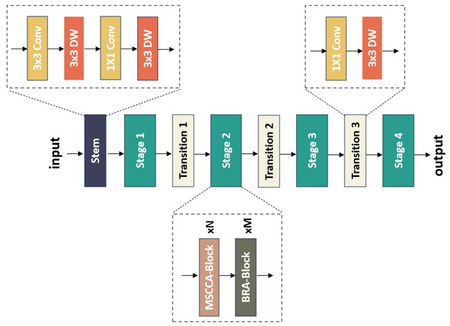

# FHBNet: A severity level evaluation model for wheat *Fusarium* head blight based on image-level annotated RGB images

## Introduction
This is the official code of FHBNet: A severity level evaluation model for wheat *Fusarium* head blight based on image-level annotated RGB images
	In FHBNet, we first utilized the multi-scale criss-cross attention (MSCCA) block, which enabled to capture the global contextual relationships from each pixel to model the spatial context of wheat ears.  Furthermore, in order to accurately locate small lesions in wheat ears, we applied the bi-level routing attention (BRA) module, which suppressed most irrelevant key-value pairs, thereby retaining only a small portion of interested regions.



## Quick start
### Install
1. Install PyTorch=0.4.1 following the [official instructions](https://pytorch.org/)
2. git clone 
3. Install dependencies: pip install -r requirements.txt

### Data preparation
You can follow the Pytorch implementation:
https://github.com/pytorch/examples/tree/master/imagenet

````
data
   |-- Light
   |-- Medium
   |-- Severe

````

Our data comes from the research of Dominik et al [1], and we have post-processed it. If you need any help, please contact me by email. Or we can process the original data according to our paper.

The data should be under ./data

### Train and test
Please specify the configuration file.

For example, train the FHBNet on data with a batch size of 16:
````bash
python train.py --data-path "your data path" --epochs 200 --batchsize 16 --lr 0.01
````


## Citation
If you find this work or code is helpful in your research, please cite：


## Reference
[1] Rößle D, Prey L, Ramgraber L, Hanemann A, Cremers D, Noack P O, Schön T. Efficient Noninvasive FHB Estimation using RGB Images from a Novel Multiyear, Multirater Dataset[J]. Plant Phenomics, 2023 Jul 14, 5: 0068. 

